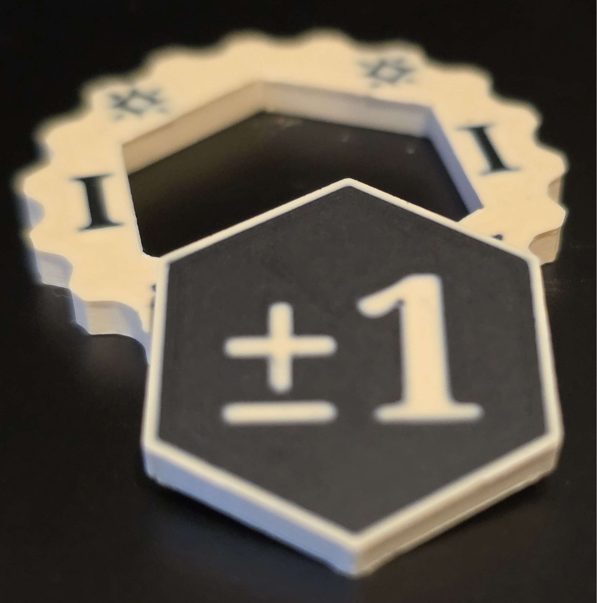

# OldSchoolDM’s Fudge Token Rules for D&D 5e
## A House Rule for 5e-compatible Dungeons and Dragons

The goal of this system is to allow for official die-roll fudging—modifying the results after the dice are rolled. Provides a *token-constrained* method for every player (including the DM) to openly change the fate (e.g. force a hit/success or miss/fail or modify damage) for any roll.

<table align="center"><tr>
<td width=200px></td>
<td width=200px></td>
</tf></table>

### History
I’ve been using this system (in various forms) since D&D 4e. It’s a lot of fun and takes the stigma of the “fudging is cheating” controversy by making it available to every player who really-really wants a little more control over their [monster’s] effectiveness. These rules are hereby released under Creative Commons [CC0 ](https://creativecommons.org/public-domain/cc0/)(do as you wish). Take, use, modify, or whatever to your heart’s content!

## Fudge Tokens TLDR;
* Primary mechanics
    * Fudge Tokens are worth +1/-1 on *any*roll and acts as modifiers (they do not change the value on the face of the die.)
    * On a roll with an undesired result, ***if the result can be changed using no more than 3 tokens***, the DM will announce the result and ask-for/announce any token(s) to be spent.
        * Anyone can contribute to a token pool (up to a maximum 3 tokens total) to spend to modify a roll.
        * Player-spent tokens are given to the DM, ad DM-spent tokens are discarded from play. 
    * **Really, *any roll* -** Fudge Tokens may be spent to *increase or decrease **any**roll, including damage* rolls, gambling results, etc. For example, reducing a Dragon’s Breath Weapon Attack by 1 or 2 hit points might keep a character conscious…
    * **Fudge Tokens are always effective** - The results of token spending are known in advance of spending and can not be cancelled or negated.
* Distributing Tokens
    * **Setup** - At the start of each session, each player is given 3 Fudge Tokens, and the DM starts with 1 Fudge Token per player at the table.
        * **Optional** - DM may choose to reward tokens for between game activities, such as session notes/reporting, helping with cleanup, uploading photos, etc. This allows a temporary exception to the limit on tokens held.
    * **Maximum Tokens Held** - No player may hold more than 3 tokens at a time, the DM may not hold more than the number of players at the table. Any extras are discarded from play. 
    * All tokens are returned to the DM at the end of the session and *do not carry over* between sessions. *Use them or lose them*.
    * **Bad Luck = Fudge Token** - If a player/DM rolls a natural one (1) and does NOT choose modify the roll in any way (Fudge Tokens, Inspiration Points, etc.) they receive a Fudge Token a consolation prize (but only if they are not at their current limit.)
    * **Optional replenishment** - Replenishing tokens at milestones (when the party “levels up”, meets a plot milestone, or starts an adventuring day) could be fun for your group

## Full description & clarifications:

### What is a Fudge Token? 
It is a physical object representing the ability to modify any die roll by adding or subtracting 1 (one) to the final result. You can use almost anything as a token. For printable options, [visit this repository](https://github.com/frankfarmer/printable-rpg-tokens) to 3D print Fudge and Inspiration tokens, shared under CC0.

### Using a Fudge Token
After any roll is made, the DM announces the effects, success, or failure as usual. If the result can be modified by ±3, **the DM will declare** the number of Fudge Tokens needed to change the outcome. Players may then decide whether to spend tokens (*up to 3 maximum per roll*).

Tokens can come from **any**player and are often contributed by players other than the one who made the roll. This **key feature** encourages everyone to pay attention to critical events, even during other players’ turns.

Fudge Tokens can be used on *any* die roll and are often used to adjust damage rolls up or down to kill or save a monster or character.

The process of a player *spending* a Fudge Token is to hand it to the DM, who adds it to their pool to be spent on monsters/challenges *later*. When a DM spends a token it is removed from the play area until replenished by a player spend or the reset conditions are met (see below.)

### All Spends are Effective
The token spend only happens if there is enough to change the result. This is spending a scarce resource to modify the results. 

#### **No Cancellation**
Once a Fudge Token is spent to modify a roll, the polarity (positive or negative) is locked. For example, if the DM spends a token to change a missed Legendary Attack into a hit, no player can negate it by spending a token in opposition Everyone that has the resources to fudge a result gets the result they pay for. 

### Gaining tokens

#### Starting Tokens
At the beginning of each session, players start with 3 Fudge Tokens. These tokens are non-transferable but may be spent on any roll. The DM begins with 1 token per player at the table.

#### Bad Luck
Rolling a natural 1 during saving throws, attacks, or skill checks under direct threat earns a Fudge Token—provided the roll is not modified or replaced.

#### OldSchoolDM’s special bonuses:
I grant bonus starting tokens for people who help out between sessions. These bonuses may temporarily be granted in excess of the 3-token held limit. I really want to encourage table-help, and it works wonders for me - especially for mid-session terrain resets…

* **Photo Uploads:** Upload photos before noon on the Saturday following a session for 2 tokens at the next session, or 1 token if uploaded later.
* **Session Cleanup/Setup Assistance:** Helping with DM setup or teardown earns 1 token for the next session. Immediate assistance during sessions earns tokens usable that same day.
* **Session Reports:** Writing reports before the next session grants 2 tokens.

####  Replenishment options
I prefer the tension created by a single initial token grant, but for longer sessions (4+ hours), I occasionally refresh tokens at major plot milestones. Depending on your group’s preferences, you might consider refreshing tokens at the start of adventuring days or during level-ups.

## Fudge Tokens for D&D 4e
These are the changes to make Fudge Tokens effective for a D&D 4e game:

* **Carry Over:** Unspent player-held tokens carry over between sessions.
* **No Limits:** There are no maximums on either Fudge Tokens *held* or tokens *spent*.

## NOTES:
I’m open to other suggestions, please leave comments/issues on the repostiory.
